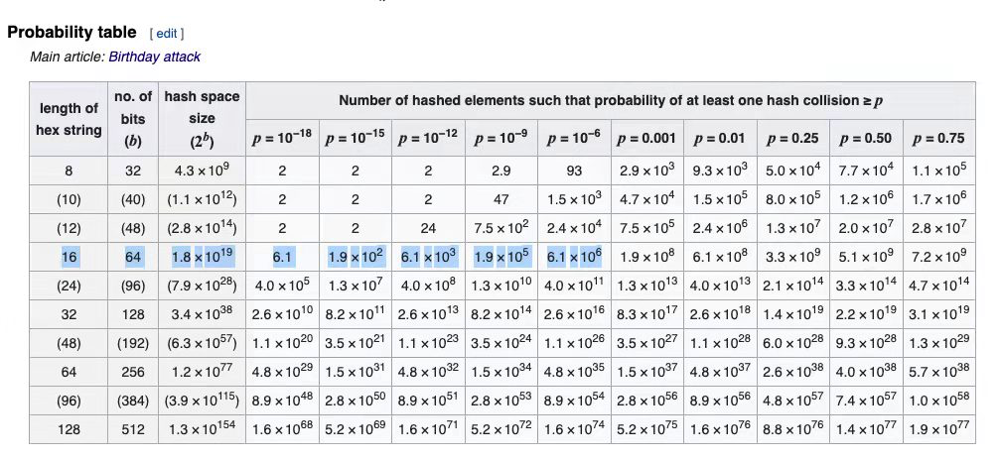

* [benchmark](./benchmark/uniqueid_test.go)
* 6种分布式id： https://blog.csdn.net/melovemingming/article/details/109108782
* https://github.com/satori/go.uuid
* https://www.zhihu.com/question/34876910

```bash
go test -bench=. -benchmem
```

